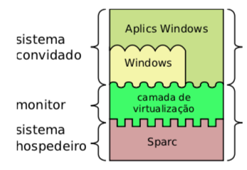

#  Virtual Machine

##  Sumário

1. Breve histórico
2. Conceitos básicos

##  Breve histórico

- 1960, IBM com o SO M44/44X e sistemas comercias virtualizados como OS/370
  - Cada usuário tinha virtualizado um sistema monousário com hardware, sistemas operacional e aplicativos
- 1970, 
  - Popek & Goldberg formalizam vários conceitos associados a máquinas virtuais
  - Experiências com ambiente UCSD p-System onde programas em Pascal são compilados para hardware abstrato (P-Machine)
- 1980 -> computadores pessoais de baixo custo, IBM PC
  - Mito do DOS
- 1990 -> VMware, Java e PC de melhor desempenho
- 2010 -> Containeres com vagrant, docker e

##  Conceitos básicos

###  Interface do sistema

**níveis de abstração**:
- Conjunto de instruções (ISA Instruction Set Architecture)
  - Instruções de usuário (User ISA)
  - Instruções do sistema (System ISA)
- Chamadas do sistema (syscalls)
- Chamadas de biblioteca (libcalls)

###  Máquina virtual

- virtualização das interfaces
- componentes de virtualização
  - sistema convidado (guest system)
  - monitor ou hipervisor (virtual machine monitor VMM)
  - sistema hospedeiro (host system)

###  Emulação

- emulação é uma forma de virtualização, onde o hipervisor virtualiza integralmente uma interface de hardware ou de sistema operacional
- Exemplo a JVM

###  Abastração

- no contexto de sistemas operacionais
  - **virtualização** consiste em criar novas interfaces a partir das interfaces existentes
  - **abstração** dos recursos é construída de forma incremental, em níveis de abstração crescentes, que seja mais simples de usar e menos dependente das tecnologias subjacentes

##  Links
